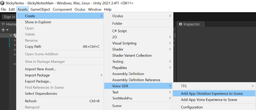
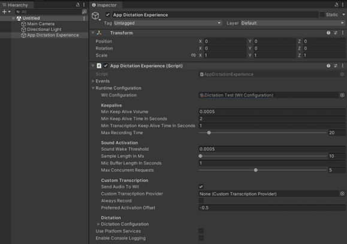
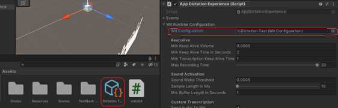

# Getting Started

To use dictation in your app, add a component to your scene that connects to Wit.ai or platform services. This is similar to adding a voice command, however, with dictation you use an AppDictationExperience component rather than an AppVoiceExperience component.

## Adding Dictation to your Scene

1. In [Wit.ai](https://wit.ai), create an app to use for dictation. This can be the same one you used for voice commands or a dedicated app specific for dictation. You do not need to train any utterances for this app.
2. In the Unity editor, create a Wit configuration file for the Wit app.
3. Open the scene to which you want to add dictation.
4. Go to Assets > Create > Voice SDK and select Add App Dictation Experience to Scene. "Adding AppDictationExperience to a scene"
   
5. Select the App Dictation Experience GameObject, and in the Inspector window, expand App Dictation Experience (script) and then expand Runtime Configuration. "Screengrab of the dictation inspector window"
   
6. From the Assets window, drag the Wit Configuration file from your Wit.ai app to the Wit Configuration field. "Adding the WitConfiguration file"
   
7. Add event handling and any other options to your scene as needed.
