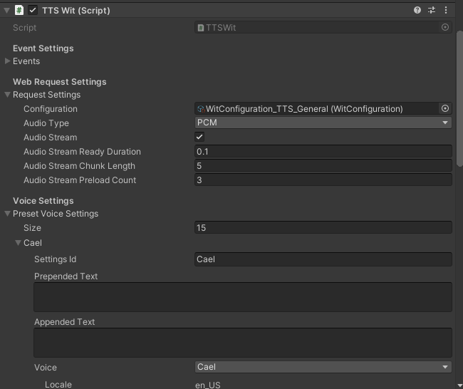

# Text-to-Speech Overview

## Overview

Voice SDK’s Text-to-Speech (TTS) feature uses a Wit.ai based service to provide audio files for text strings. It’s handled by a single TTSService prefab for all TTS settings and you can use a simple TTSSpeaker script for each scene location in which a TTS clip can be played.

To keep TTS working smoothly, Voice SDK handles the caching of TTS files during runtime (or when otherwise needed). If streaming TTS audio files is not an option for your application, however, you can set it to use preloaded static TTS files prior to building your app.

## Setup

Use the following steps to set up TTS for your app once the plugin has been imported:
1. Open the scene you want to use TTS within.
2. Generate a new Wit Configuration using the Wit Configurations menu within the **Oculus** > **Voice SDK** > **Voice HUB**.  Ensure it refreshes successfully and displays all voices available for your configuration.
3. Navigate to **Assets** > **Create** > **Voice SDK** > **TTS** > **Add Default TTS Setup**
4. In your scene heirarchy navigate inside the newly generated **TTS** Game Object to select the **TTSWitService** Game Object and adjust the inspector to fit your needs:
    1. Use **TTSWit** > **Request Settings** > **Configuration** to select the Wit Configuration asset generated in step 2.
    2. Once your configuration is setup, go to **Preset Voice Settings** and setup any voices that might be shared by multiple **TTSSpeakers**. For more information, see [TTS Voice Customization](https://developer.oculus.com/documentation/unity/voice-sdk-tts-voice-customization).

    3. Under **TTS Runtime Cache (Script)**, adjust the settings to indicate how often clips will be automatically uploaded from memory. For more information, see [TTS Cache Options](https://developer.oculus.com/documentation/unity/voice-sdk-tts-cache-options).
    4. If needed, adjust your disk cache directory location and name in the tree under **TTS Disk Cache (Script)**.

5. Move & duplicate the **TTSSpeaker** to all the locations in your app where you would like TTS to be played.
6. Modify each **TTSSpeaker** via the Inspector to fit your needs:
    1. Under **Voice Settings**, select the **Voice Preset** for the specific speaker or select Custom to apply speaker specific settings.
    2. Adjust the **AudioSource** in order to add the TTSSpeaker to a custom audio group or set audio from 2D to 3D.
7. Via a script use the following **TTSSpeaker** methods to load and play text.
    1. Use the **TTSSpeaker** script’s `Speak(textToSpeak : string)` method to request and say specified text on load.
    2. Use the **TTSSpeaker** script’s `SpeakQueued(textToSpeak : string)` method to request and say specified text.
    3. Send a custom **TTSSpeaker** into any `Speak`/`SpeakQueued` method for request specific text load & playback event callbacks.
    4. Use the **TTSSpeaker** script’s `Stop()` method to immediately stop all loading & playing TTS clips.
    5. Use **TTSSpeaker**'s `Stop(textToSpeak : string`)` to immediately stop loading & playing of a specific text string.

**Note** Check out `Samples/TTSVoices/TTSVoices.unity` for an example of TTS implementation.
